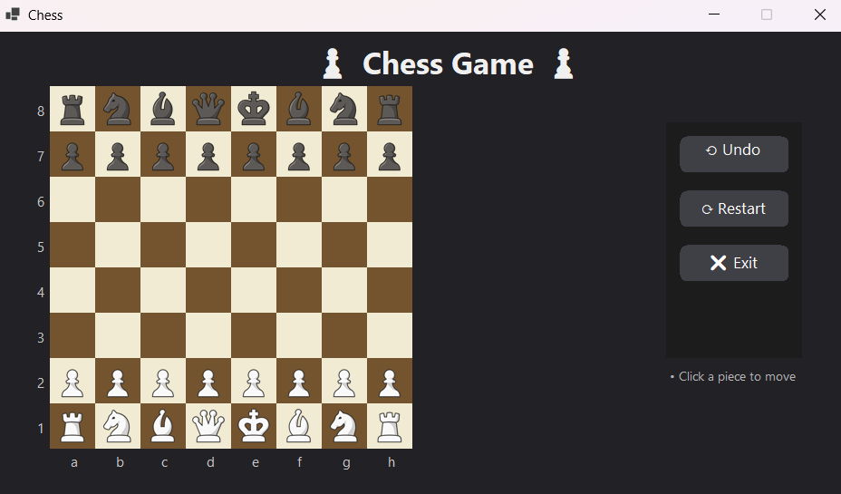

# ♟️ Vanilla C# Chess (WinForms)

Проект шахмат на C# с использованием Windows Forms.  
Реализуется с нуля без сторонних движков - логика, UI, архитектура и механики создаются вручную.

---

## 📂 Архитектура

Проект организован по слоям:

- `Form` - графический интерфейс (WinForms)
- `GameEngine` - управление логикой игры
- `Entities` - фигуры, клетки, доска
- `Services` - бизнес-логика (валидация ходов, управление цветами и пр.)
- `Factories` - генерация фигур и стартового положения

---

## 🔧 Статус

🛠️ В разработке

### На текущий момент реализовано:

- Отрисовка доски и фигур
- Перемещение фигур с базовой проверкой правил
- Обработка пользовательских нажатий
- Валидация ходов
- Логика шаха, мата, рокировки, превращения пешки
- Логирование ходов, что позваляет делать омену хода(с учетом ракировки)
- Полностью отделена UI от логики
- Реализован простенький DI c нуля, без использования библиотек

### В планах:

- Написать unit-тесты
- Реализовать базового ИИ-соперника
- Завершить все отмеченные TODO (оптимизация, рефакторинг и т.д.)

---

## 🚀 Запуск

1. Клонировать репозиторий
2. Открыть решение `WinFormsApp1.sln` в Visual Studio 2019 или новее
3. Убедиться, что установлен **.NET 9.0 SDK (Windows)**
4. Собрать и запустить проект

---

## 📌 Цели проекта

- Изучить устройство шахматной логики на практике
- Освоить C# и принципы многослойной архитектуры
- Реализовать полноценную механику шахмат (включая шах, мат, пат и другие особенности)

---

## 📬 Обратная связь

Для предложений и замечаний - открывайте Issue или используйте раздел Discussions.
